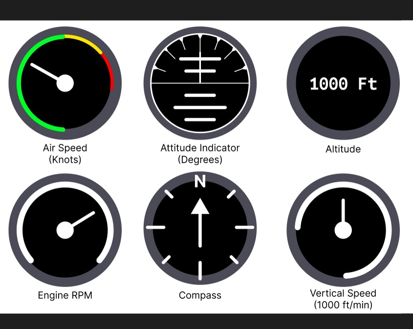
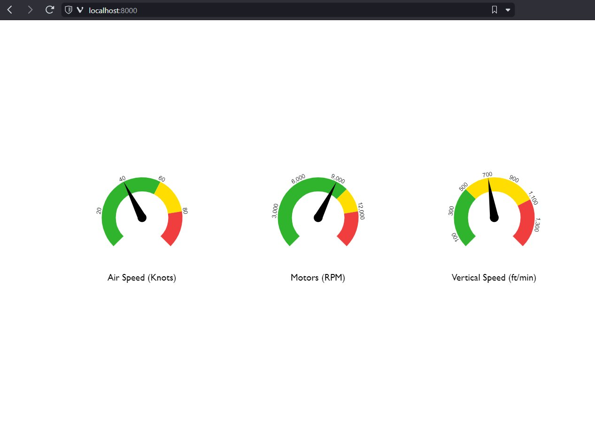
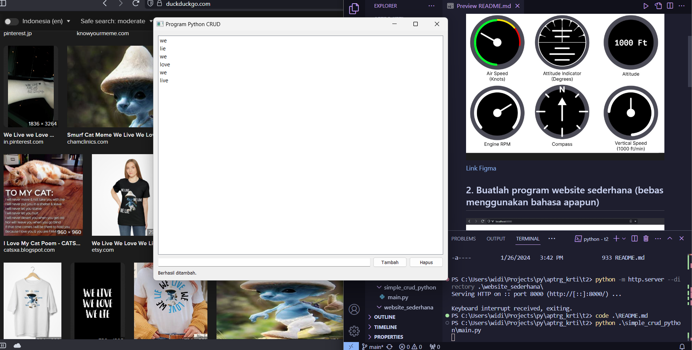

# Untuk Magang APTRG, Soal GCS

## 1. Buat mock up tampilan interface untuk wahana (bebas menggunakan software apapun, diutamakan menggunakan figma)


[Link Figma](https://www.figma.com/file/lHuazjbyPE4oDXG0WzFQX0/Magang_APTRG?type=design&node-id=0%3A1&mode=design&t=kvRCQyH0sAFT5Scx-1) 

## 2. Buatlah program website sederhana (bebas menggunakan bahasa apapun)



[Source code ada di sini](website_sederhana)

```bash
git clone https://github.com/mhafiz03/testing
cd testing/website_sederhana
python -m http.server
```

Buka http://localhost:8000 di web browser

## 3. Buatkan program crud menggunakan bahasa python



[Source code ada di sini](simple_crud_python)

#### Cara menjalankan
Pastikan python sudah di install

```bash
git clone https://github.com/mhafiz03/testing
cd testing
pip install PyQt5
python simple_crud_python/main.py
```

-Hatur nuhun